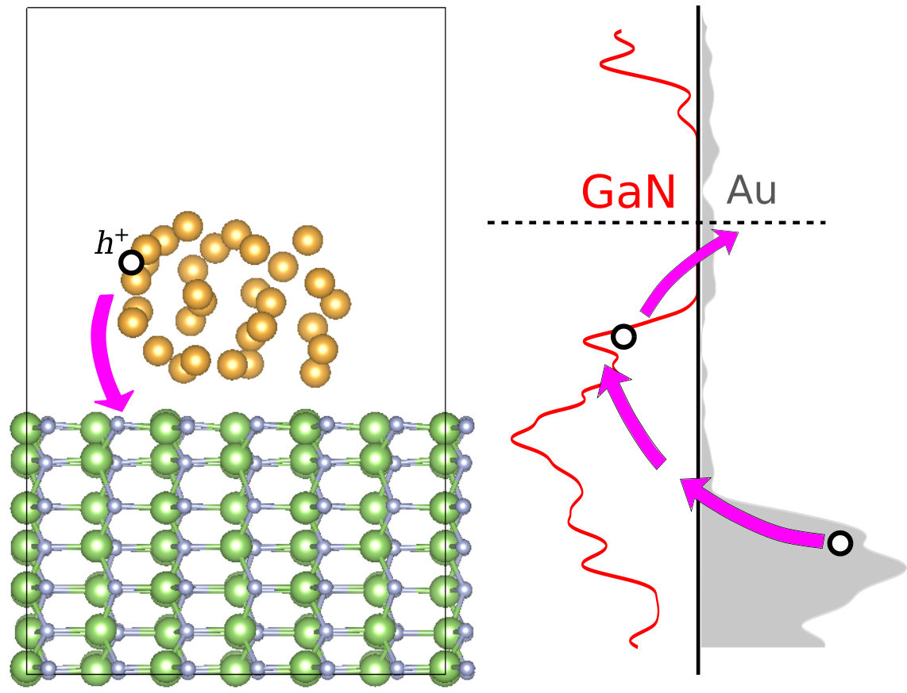

### Hot-carrier cooling and charge transfer across interface

Plasmon photochemistry can potentially play a significant role in photocatalysis. 
To realize this potential, it is critical to enhance the plasmon excited hot 
carrier transfer and collection. We apply the non-adiabatic molecular dynamics (NAMD)
simulation to study hot carrier dynamics in the system of Au nanocluster on 
top of GaN surface. By setting up the initial excited hole in Au, the carrier 
transfer from Au to GaN is found to be on a sub-pico second time scale. By applying 
different external potentials to mimic the Schottky-barrier band bending, the 
charge transfer efficiency can be enhanced, demonstrating the importance of the 
internal electric field. Finally, with the understanding of the carrier transfer's 
pathway, we suggest that a ZnO layer between GaN and Au can effectively block the 
"cold" carrier from returning back to Au but still allow the hot carrier to transfer 
from Au to GaN.

### Large Polaron Formation and its Effect on Electron Transport in Halide Perovskite

Many experiments have indicated that large polaron may be formed in hybrid 
perovskite, and its existence is proposed to enhance the long lifetime for 
the carriers. However, detailed theoretical study of the large polaron and 
its effect on carrier transport at the atomic level is still lacking. Here, 
we implement tight-binding model fitted from the density-functional theory 
and we find that the formation energy of the large polaron is around -12 meV. 
By performing the explicit time-dependent wavefunction evolution of the polaron 
state, the diffusion constant and mobility of the large polaron state driven 
by the dynamic disorder and the sublattice vibration are obtained. 

### Non-adiabaticity in CO2 reduction reactions

### Rashba effect in halide perovskite

Halide perovskites are promising solar-cell materials for next-generation 
photovoltaic applications. The long carrier lifetime and diffusion length of these materials make them very attractive for use in light absorbers and carrier transporters. While these aspects of organometal halide perovskites have attracted the most attention, the consequences of the Rashba effect, driven by strong spin–orbit coupling, on the photovoltaic properties of these materials are largely unexplored. In this work, taking the electronic structure of CH3NH3PbI3 (methylammonium lead iodide) as an example, we propose an intrinsic mechanism for enhanced carrier lifetime in three-dimensional (3D) Rashba materials. On the basis of first-principles calculations and a Rashba spin–orbit model, we demonstrate that the recombination rate is reduced due to the spin-forbidden transition. These results are important for understanding the fundamental physics of organometal halide perovskites and for optimizing and designing the materials with better performance. The proposed mechanism including spin degrees of freedom offers a new paradigm of using 3D Rashba materials for photovoltaic applications.

## Complex structures

### Crystalline Si and amorphous SiO2 interface: the effect of the interfacial width to the band offset

